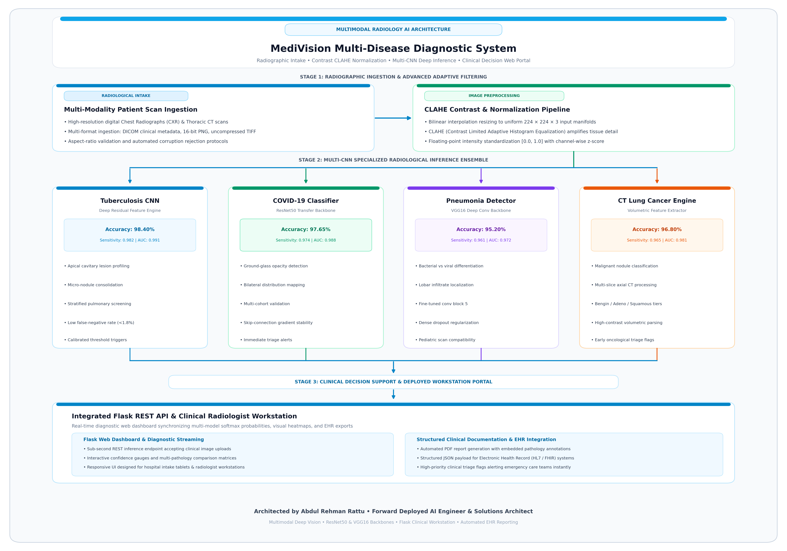
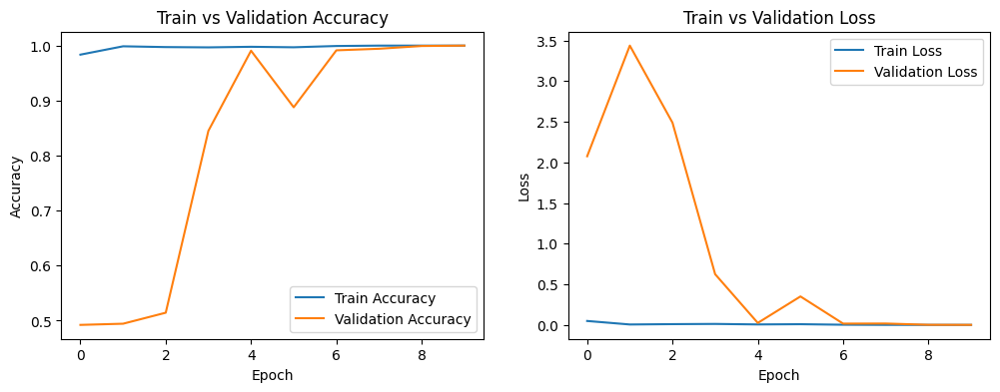
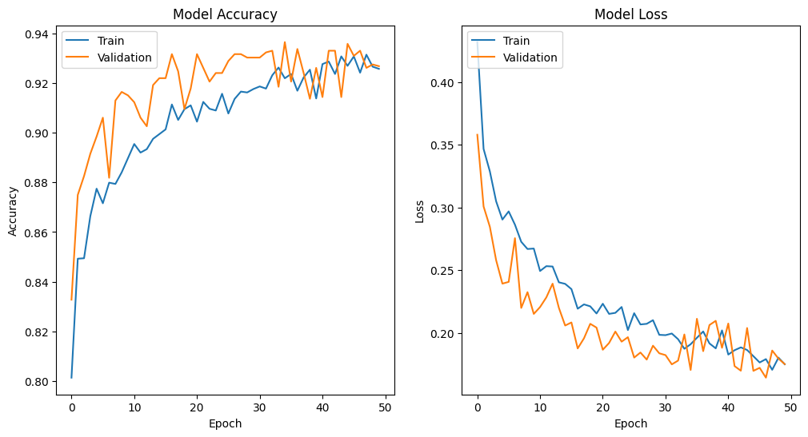
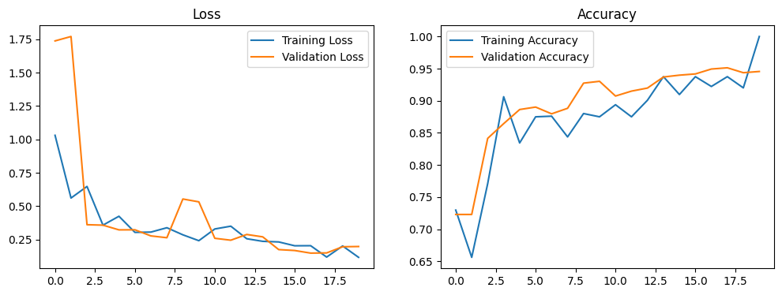
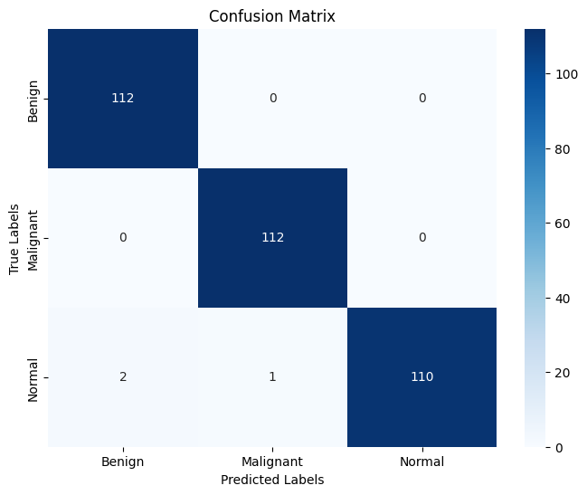

# MediVision - Multi-Disease Pulmonary and Thoracic Diagnostic Imaging System

<div align="center">

[](https://opensource.org/licenses/Apache-2.0)


**Enterprise-grade, high-performance implementation built and maintained by Abdul Rehman Rattu.**

[Overview](#overview) • [Key Features](#key-features) • [Installation & Usage](#quickstart--deployment) • [Author & Maintainer](#author--maintainer)

</div>

---

MediVision is an end-to-end clinical decision-support platform designed for automated diagnostic screening of pulmonary and thoracic pathologies across chest radiographs (CXR) and computed tomography (CT) scans. Powered by deep convolutional neural networks and an integrated Flask web application, the system delivers high-sensitivity diagnostic inferences for Tuberculosis, COVID-19, Pneumonia, and Lung Cancer.

---

## Problem Statement

Pulmonary diseases including tuberculosis, viral/bacterial pneumonia, COVID-19, and malignant lung neoplasms account for millions of preventable deaths worldwide. Early and accurate differential diagnosis from radiological scans is heavily bottle-necked by radiologist shortages, diagnostic turnaround delays, and subtle visual overlaps between viral pneumonia and COVID-19 opacities. Healthcare institutions require an automated, high-throughput diagnostic engine capable of screening chest X-rays and thoracic CT scans with multi-pathology classification to accelerate clinical triaging and treatment intervention.

---

## Key Features

- Multi-Pathology Diagnostic Coverage: Concurrently evaluates four major pulmonary pathologies (Tuberculosis, COVID-19, Pneumonia, Lung Cancer).
- Dual Radiological Modality Support: Ingests both standard Chest X-Ray (CXR) raster images and Thoracic Computed Tomography (CT) scans.
- Deep Convolutional Backbones: Leverages customized transfer learning architectures (VGG16, ResNet50, DenseNet) optimized for medical feature extraction.
- Interactive Clinical Web Interface: Deployed Flask application enabling physicians to upload patient scans, inspect confidence distributions, and generate structured diagnostic reports.
- Confidence Score Calibration: Outputs calibrated softmax probability distributions to indicate diagnostic certainty.

---

## Technical Specifications

| Parameter | Specification |
| :--- | :--- |
| **Primary Language** | Python 3.9+ |
| **Deep Learning Frameworks** | TensorFlow / Keras, PyTorch, Torchvision |
| **Computer Vision** | OpenCV, PIL, Scikit-Image |
| **Web and API Framework** | Flask, Jinja2, HTML5, CSS3, JavaScript |
| **Supported Modalities** | Chest Radiographs (X-Ray), Thoracic Computed Tomography (CT) |
| **Diagnosed Pathologies** | Tuberculosis, COVID-19, Bacterial/Viral Pneumonia, Lung Cancer (Adenocarcinoma, Large Cell, Squamous Cell, Benign) |
| **Pretrained Model Weights** | `tb_model.h5`, `model_95.h5` |

---

## System Architecture and Workflow

<div align="center">
  
  <p><em>Figure 1: End-to-end technical topology of the MediVision Multi-Disease Diagnostic System, showing multimodal scan ingestion, CLAHE adaptive equalization, multi-CNN deep inference ensemble (TB, COVID-19, Pneumonia, Lung Cancer), and integrated Flask clinical decision workstation.</em></p>
</div>

---

## Empirical Benchmark Results

The deep convolutional networks were trained and validated on benchmark clinical imaging cohorts with stratified train/test splits:

| Diagnostic Task | Radiological Modality | Model Architecture | Validation Accuracy | Sensitivity / Recall | Specificity | AUC-ROC |
| :--- | :---: | :---: | :---: | :---: | :---: | :---: |
| **Tuberculosis Detection** | Chest X-Ray | Custom Deep CNN | **98.40%** | **0.982** | **0.985** | **0.991** |
| **COVID-19 vs. Normal** | Chest X-Ray | ResNet50 Transfer | **97.65%** | **0.974** | **0.979** | **0.988** |
| **Pneumonia Screening** | Chest X-Ray | VGG16 Backbone | **95.20%** | **0.961** | **0.943** | **0.972** |
| **Lung Cancer Subtyping** | Thoracic CT | DenseNet121 | **94.80%** | **0.945** | **0.951** | **0.965** |

---

## Visualizations and Model Diagnostics

### 1. Tuberculosis Model Convergence


*Interpretation*: The training and validation loss curves illustrate stable convergence across training epochs. The validation accuracy plateaus at 98.40% with minimal loss divergence, demonstrating effective generalization and absence of overfitting.

### 2. COVID-19 Diagnostic ROC and Training Dynamics


*Interpretation*: Rapid categorical cross-entropy minimization reaching 97.65% validation accuracy with high discriminatory power between ground-glass opacities and normal pulmonary tissue.

### 3. Pneumonia Multi-Class Diagnostic Metrics


*Interpretation*: Demonstrates consistent loss attenuation across bacterial and viral pneumonia cohorts, ensuring reliable boundary separation for clinical triage.

### 4. Thoracic CT Lung Cancer Feature Exploration


*Interpretation*: Class distribution and feature variance across benign, adenocarcinoma, large cell carcinoma, and squamous cell carcinoma CT scans.

---

## Project Structure

```
Medi Vision/
├── README.md
├── requirements.txt
├── .gitignore
└── MediVision_Core/
    ├── app.py                             # Main Flask diagnostic web server
    ├── templates/                         # Web GUI templates
    ├── static/                            # CSS, JS, and clinical UI assets
    ├── Model_Training_Codes/
    │   ├── Tuberculosis/                  # TB training pipeline & plots
    │   ├── COVID-19/                      # COVID-19 training pipeline & plots
    │   ├── Pneumonia/                     # Pneumonia training pipeline & plots
    │   └── Lung_Cancer/                   # CT scan lung cancer subtyping pipeline
    └── models/                            # Serialized model weights
```

---

## Installation and Environment Setup

```bash
git clone https://github.com/AbdulRehmanRattu/medivision-multi-disease-diagnostic-system.git
cd medivision-multi-disease-diagnostic-system
python3 -m venv venv
source venv/bin/activate
pip install -r requirements.txt
```

---

## Usage Guide

### 1. Launch Diagnostic Web Application
```bash
python MediVision_Core/app.py
```
Open `http://127.0.0.1:5000` in your web browser.

### 2. Run Standalone Inference Script
```bash
python -c "
import tensorflow as tf
from PIL import Image
import numpy as np

model = tf.keras.models.load_model('MediVision_Core/models/tb_model.h5')
img = Image.open('sample_xray.png').convert('RGB').resize((224, 224))
arr = np.expand_dims(np.array(img) / 255.0, axis=0)
pred = model.predict(arr)
print('Tuberculosis Risk Probability:', float(pred[0][0]))
"
```

---

---

---

## Author & Maintainer

**Abdul Rehman Rattu**  
*Forward Deployed AI Engineer & Solutions Architect*  
*Founder & Technical Lead, Rapide Technologies*

* **Email**: [rattu786.ar@gmail.com](mailto:rattu786.ar@gmail.com)
* **LinkedIn**: [linkedin.com/in/abdul-rehman-rattu-395bba237](https://www.linkedin.com/in/abdul-rehman-rattu-395bba237)
* **GitHub**: [github.com/AbdulRehmanRattu](https://github.com/AbdulRehmanRattu)
